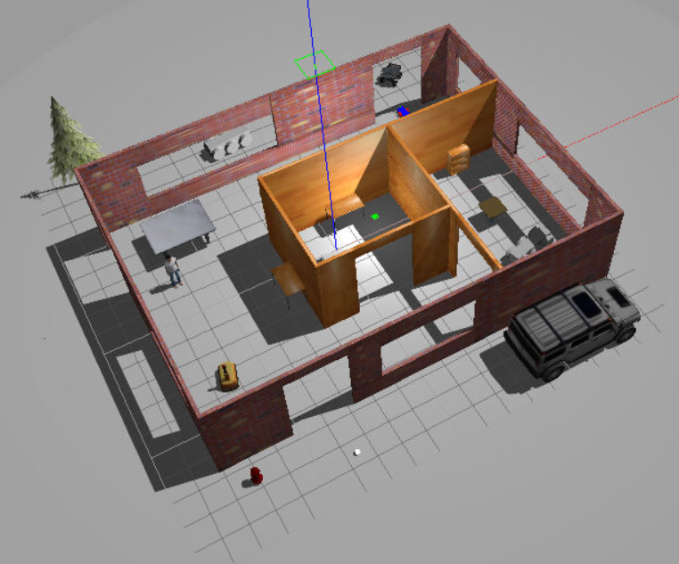
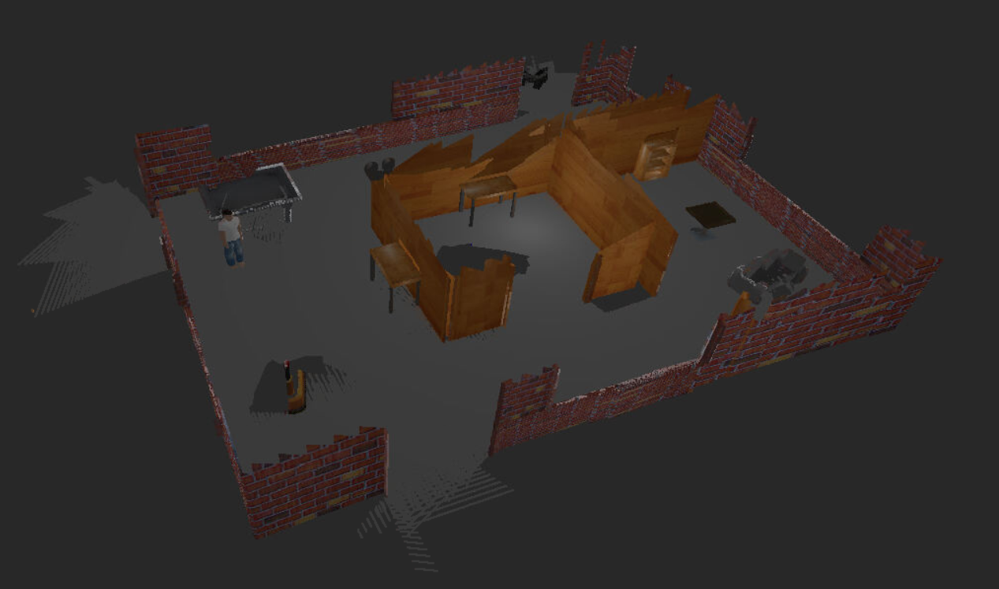
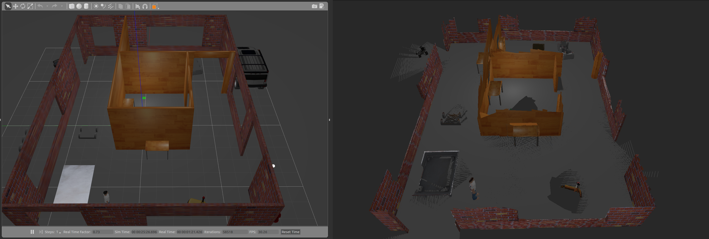

# mapping

This project creates a 2D occupancy grid and 3D octomap from a simulated environment using the ROS RTAB-Map package. RTAB-Map (Real-Time Appearance-Based Mapping) is a popular solution for SLAM to develop robots that can map environments in 3D. 

The [ROS RTAB-Map package](http://wiki.ros.org/rtabmap_ros) is a ROS wrapper (API) for interacting with RTAB-Map. The robot configuration in this project includes a 2D laser, odometry sensors, and a 3D Kinect camera. 
The [ROS teleop package](http://wiki.ros.org/teleop_twist_keyboard) is also included which allows the user to navigate the robot in the environment and perform RTAB-Mapping. Localization using RTAB-Map is also performed. 


## Screenshots
Comparison between the Gazebo world simulation (top) and the generated 3D map (bottom): 


Direct comparison between the simulation and generated map: 



## Building
Prerequisites/Dependencies: [Gazebo](http://gazebosim.org/) and ROS. 

With the prerequisites met, source global ros: 
```
$ source /opt/ros/<your_ros_version>/setup.bash
```
Create a catkin workspace:
```
$ mkdir -p catkin_ws/src && cd catkin_ws
```
Clone the driver:
```
$ git clone https://github.com/mulbarry/mapping.git src/mapping
```
Install dependencies:
```
$ sudo apt update -qq
$ rosdep update
$ rosdep install --from-paths src --ignore-src -y
```
Build the workspace:
```
$ catkin_make
```
Activate the workspace:
```
$ source devel/setup.bash
```

## Launching
Launch the Gazebo world and RViz, spawn the robot in the environment:
```
$ roslaunch my_robot world.launch
```
Open a new terminal and launch the teleop node:
```
$ cd catkin_ws
$ source devel/setup.bash
$ rosrun teleop_twist_keyboard teleop_twist_keyboard.py
```
Open another terminal and launch the mapping node:
```
$ cd catkin_ws
$ source devel/setup.bash
$ roslaunch my_robot mapping.launch
```

## Database Viewer
The rtabmap-databaseViewer tool can be used to explore the database after it has been generated. It is isolated from ROS and allows for complete analysis of the mapping session. Open a new terminal and run the following: 
```
$ rtabmap-databaseViewer ~/.ros/rtabmap.db
```
Click "yes" when prompted about using the database parameters, and add different views (e.g. Constraints View, Graph View) to get a better view of the relevant information. 
